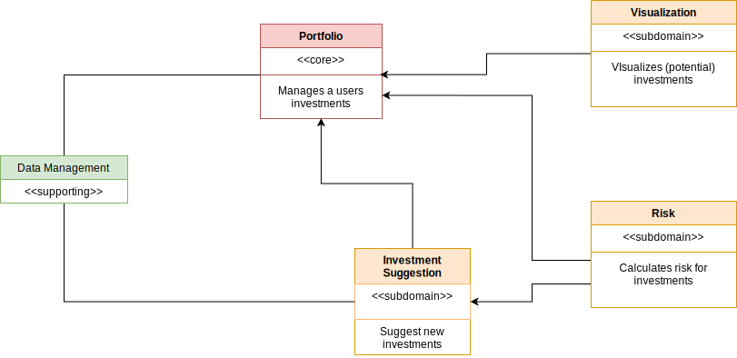
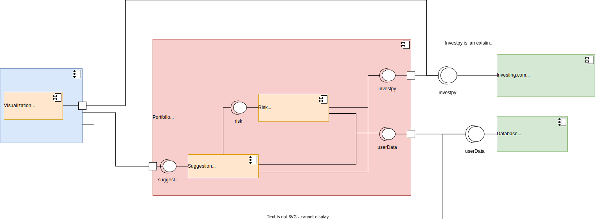

# Pyfolio
### A management system for stocks

Pyfolio is a tool for managing stocks. All stocks owned are part of a persons portfolio. The history of the stocks is presented in
several different graphs. Additionally the risk of the portfolio is calculated and new stocks are recomended to minimize risk.

Buildmanagement -- pybuilder

### Domains

###

