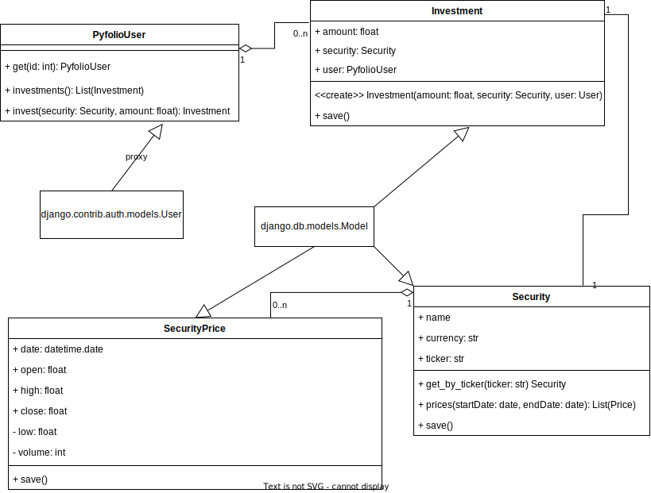

# Pyfolio
### A management system for stocks

Pyfolio is a tool for managing stocks. All stocks owned are part of a persons portfolio. The history of the stocks is presented in
several different graphs. Additionally the risk of the portfolio is calculated and new stocks are recomended to minimize risk.

---

### Domains
The core domain of pyfolio is the Portfolio which holds a users investments and encompasses subdomains such as 
Visualization and Risk.
Supporting subdomains are the Data Management, for keeping track of a users investments and holding security data, as well
as the Frontend, for presenting the portfolio contents and allowing easy access.

---

### Components
Pyfolio consists of four docker containers. The 'security\_update' for continously updating stock data in the database, the 'portfolio' for managing
a users portfolio, the 'frontend' for displaying a users portfolio and security data as well as a database.

---

### ER Diagram
The database holds four tables. The 'User' which is provided by django for holding user information, such as login information. Each 'User'
can have multiple 'Investment's for displaying how many instances of one 'Security' the user holds.
'Security' abstracts a security one can buy at an exchange. Each 'Security' has multiple associated 'SecurityPrice's,
which hold daily data on that 'Security'.

---

### security\_access
'security\_access' contains ORM Models for accessing the tables defined above and providing an easily understandable interface to the database.

---

### DataUpdater
The 'DataUpdater' is responsible for updating the security data in the database.

##### Class diagram

##### Sequence diagram

